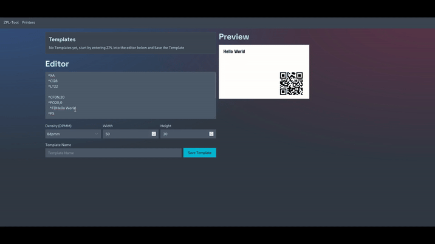
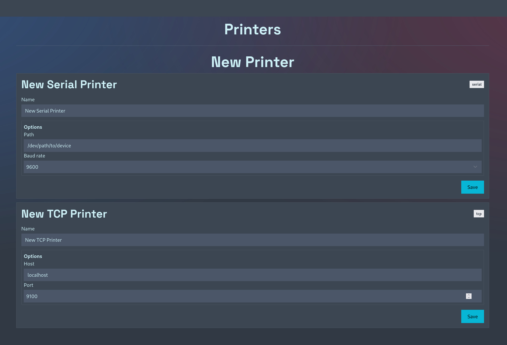
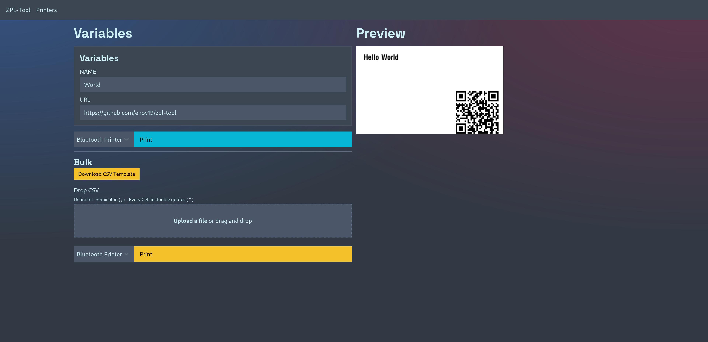

# zpl-tool

zpl-tool is a webapp designed for managing multiple ZPL templates.
It provides an easy-to-use interface for managing ZPL templates with the ability to insert variables such as `${MY_VARIABLE}` directly into your templates.
zpl-tool features a live preview of the templates (powered by [labelary.com](https://labelary.com) and/or [BinaryKits.Zpl](https://github.com/BinaryKits/BinaryKits.Zpl) ), which automatically updates as you develop your template.

Besides template management, zpl-tool also provides support for managing multiple printers, including serial and tcp network printers.

## Features

- **✏️ Manage Multiple ZPL Templates**: Easily handle multiple ZPL templates with variable support.
- **🔍 Live Template Preview**: Generates a live preview of the templates with automatic updates when testing variables.
- **🖨️ Support for Multiple Printers**: Manage multiple printers, including Serial and TCP printers.
- **🔢 Bulk Printing**: Efficiently print in bulk by providing a CSV file.
- **📄 PDF Printing**: Print any PDF file.

## Quick Start

### **Run zpl-tool using Docker / Docker Compose**

<details>
<summary><strong>Using docker-compose:</strong></summary>

Create a file named `docker-compose.yml` in your directory and paste the following content:

```yaml
version: '3'

services:
  zpl-tool:
  image: ghcr.io/enoy19/zpl-tool:main
  ports:
    - '3000:3000'
  volumes:
    - './data:/app/data'
```

After saving the file, run the following command to start zpl-tool:

```sh
docker compose up
```

zpl-tool will be available at [http://localhost:3000](http://localhost:3000).

</details>

<details>
<summary><strong>Using docker run:</strong></summary>

You can use the following `docker run` command:

```sh
docker run -p 3000:3000 -v $(pwd)/data:/app/data ghcr.io/enoy19/zpl-tool:main
```

After running this command, zpl-tool will be available at [http://localhost:3000](http://localhost:3000).

</details>

## Usage

### Managing ZPL Templates

- **Create a New Template**: Start typing into the textarea below `Editor`
- **Insert Variables**: Insert variables into your template. Format: `${VARIABLE_NAME}`. The variables will automatically be available in the `Variables` section.
- **Live Preview**: When you edit your template or the values of your variables, the preview updates automatically.

  

### Managing Printers & Printing

- **Navigate to Printers**: Click `Printers` in the navigation bar.
- **Add a Printer**: Add a serial or tcp printer by entering the configuration and saving.

  

- **Print**:

  - Navigate back the the home page.
  - click on `Print` on one of your templates.
  - Select your printer in the dropdown next to the `Print` button
  - click `Print`

    

### Printing PDF

- **Navigate to Print PDF**: Click `Print PDF` in the navigation bar.
- **Drop your PDF**: Drag&Drop you PDF file into the upload zone or click the zone and select your file.
- **Print**: Click print!
- **⚠️ IMPORTANT ⚠️**: You need to configure the Printer dimensions and dpmm in the `Printers` page.

## Developing

### Prerequisites

- GraphicsMagick + ghostscript
  - RPM: `sudo dnf install GraphicsMagick ghostscript`
  - Debian / Mac / Windows: https://github.com/yakovmeister/pdf2image/blob/HEAD/docs/gm-installation.md

Once you've cloned the repository and installed dependencies with `npm install` (or `pnpm install` or `yarn`), start a development server:

```bash
npm run dev

# or start the server and open the app in a new browser tab
npm run dev -- --open
```

## Building

To create a production version of your app:

```bash
npm run build
```

You can preview the production build with `npm run preview`.

> To deploy your app, you may need to install an [adapter](https://kit.svelte.dev/docs/adapters) for your target environment.
